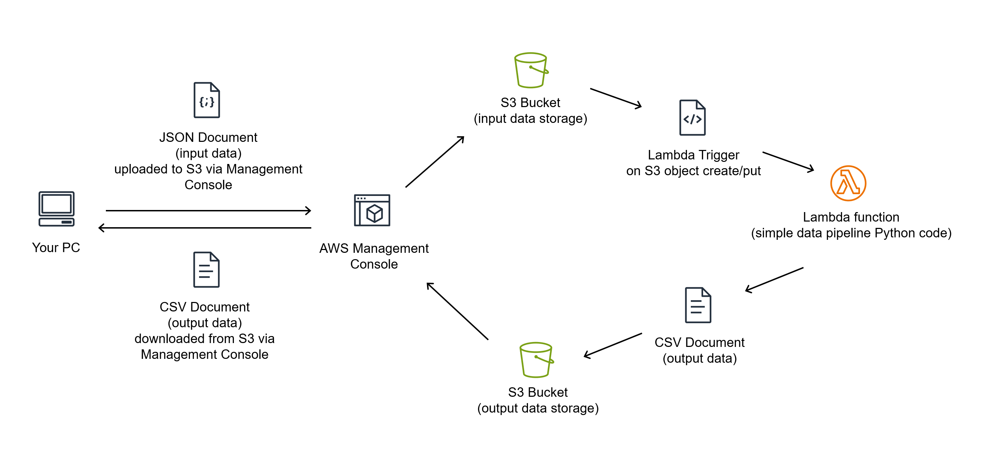

# aws-simple-data-pipeline

This repository contains instructions for creating a simple data pipeline using Amazon S3 and AWS Lambda.

Skill level: Beginner

This data pipeline will take input data that is uploaded in JSON format to an S3 Bucket, transform the data using Python code, and store the transformed data in another S3 bucket.

The mock API data comes from a public data set called [Electric Vehicle Population Data](https://catalog.data.gov/dataset/electric-vehicle-population-data). The Python code used to transform the data removes metadata and selects specfic output columns.

## Requirements

The only requirement to create this simple data pipeline is an Amazon Web Services (AWS) account, for which you have Administrator access. If you do not have an existing AWS account, you can follow the instructions [here](https://docs.aws.amazon.com/accounts/latest/reference/manage-acct-creating.html) to create your own AWS account. Once you have access to an AWS account, you can continue to the next section.

NOTE: Using Amazon Web Services (AWS) costs money. If you create an AWS account to follow along with this tutorial, you will be required to input credit card information in order to pay for the services that you use. Following along with this tutorial and triggering the data pipeline less than 100 times should not generate spend greater than $2 USD/month at the time of writing; however, you run this code at your own expense and risk in your AWS account.

## Building the simple data pipeline

Follow the step-by-step instructions that follow to build this simple data pipeline using Amazon S3 and AWS Lambda:



The data pipeline will ingest the JSON data files uploaded to the input bucket, remove metadata, select specific columns from the data, and output a CSV file to the output bucket. The outputted file will contain the name and extension of the input file, suffixed with a timestamp (Ex: mock-api-data.json__20230101_120000).

### Step 1: create an S3 Bucket to store the input data

Navigate to the S3 service in your AWS account. You can find the S3 service by searching in the search bar at the top of the page while you are logged into the AWS Management Console. Click on "S3" to go to the service page.

On the S3 service page, click the button labeled "Create bucket" to start creating a new bucket.

When creating your S3 Bucket, you need to give it a globally-unique name; this means that no other S3 bucket in any AWS account can have the same name. You can <em>almost</em> guarantee a globally unique name by following this pattern: `input-data-YYYYMMDD-YOUR_FIRST_INITIAL-COLOR`. Input the name into the field labeled "Bucket name" and scroll to the bottom of the page. Click on the "Create bucket" button.

After the bucket is created, copy the name for the bucket and store it somewhere on your computer (Ex: an empty text document) for later.

### Step 2: create an S3 Bucket to store the output data

Create an additional bucket as instructed in [Step 1](#step-1-create-an-s3-bucket-to-store-the-input-data), but this time, use this naming convention for the bucket: `output-data-YYYYMMDD-YOUR_FIRST_INITIAL-COLOR`. Copy the name for this bucket and store it where you stored the name for the input data bucket.

### Step 3: create a Lambda function to transform the input data and store the output data

Navigate to the Lambda service in your AWS account. You can find the Lambda service by searching in the search bar at the top of the page while you are logged into the AWS Management Console. Click on "Lambda" to go the service page.

On the lambda service page, click the button labeled "Create function" to start creating a new function.

Your Lambda function does not need to be globally unique; it just has to be unique to your AWS account. Name the function `python-simple-data-pipeline`.

Change the runtime for this function to the latest version of Python. At the time of writing, the latest version is 3.10. Click on the "Create function" button.

### Step 4: modify the permissions of the Lambda function

In order to read from the input data bucket, your Lambda function needs to have explicit permissions to read from the input data bucket. In order to write data to the output data bucket, your Lambda function needs to have explicit permissions to write to the output data bucket. 

Navigate to the Lambda service in your AWS account and select your new function called `python-simple-data-pipeline` to edit the function  settings. Under the "Configuration" tab, select "Permissions" to display the Execution role of the Lambda function. Click the role name to open the role settings.

Click the dropdown labeled "Add permissions", and select "Create inline policy".

In the Visual editor, type "S3" in the filter field and select "S3" from the filtered options.

Under Actions > Access level, expand the "List" options and check the "ListBucket" permission.

Under Actions > Access level, expand the "Read" options and check the "GetObject" permission.

Under Resources click "Add ARN" to restrict access and paste the input bucket name in the Bucket name field. Next to the Object name field, select the checkbox labeled "Any", then click "Add".

Click "Review policy", then name the policy `read-YOUR_INPUT_DATE_BUCKET_NAME". Click "Create policy".

Click the dropdown labeled "Add permission" again, and select "Create inline policy".

In the Visual editor, type "S3" in the filter field and select "S3" from the filtered options.

Under Actions > Access level, expand the "Write" options and check the "PutObject" permission.

Under Resources > bucket click "Add ARN" to restrict access and paste the input bucket name in the Bucket name field. Next to the Object name field, select the checkbox labeled "Any", then click "Add".

Under Resources > object click "Add ARN" to restrict access and paste the input bucket name in the Bucket name field. Next to the Object name field, select the checkbox labeled "Any", then click "Add".

Click "Review policy", then name the policy `write-YOUR_OUTPUT_DATA_BUCKET_NAME". Click "Create policy".

### Step 5: create the trigger to invoke the Lambda function when a file is added to or overwritten in the input data bucket

Navigate to the Lambda service in your AWS account and select your new function called `python-simple-data-pipeline` to edit the function settings. Under Function overview, click "Add trigger".

Click the dropdown labeled "Select a source" and type "S3" to filter the results. Select "S3" from the filtered options.

Paste in the name of your input data bucket in the field labeled "Bucket".

Click the Event types field and select the checkbox labeled "PUT".

Check the box acknowledging Recursive invocation and click "Add".

### Step 6: define the Lambda function

Navigate to the Lambda service in your AWS account and select your new function called `python-simple-data-pipeline` to edit the function code. Paste the following Python code into your function, changing the the values for variables `input_bucket_name` and  `output_bucket_name` to the name of your buckets.

```
import boto3
import csv
from datetime import datetime
import json


def lambda_handler(event, context):
    try:
        # Define S3 resoruce
        s3 = boto3.resource('s3')
        
        # Define input bucket
        input_bucket_name = 'input-data-20230425-s-blue'
        
        # Define input file name
        input_file_name = event['Records'][0]['s3']['object']['key']
        
        # Define output bucket
        output_bucket_name = 'output-data-20230425-s-green'
        
        # Define timestamp
        timestamp = datetime.now().strftime("%Y%m%d_%H%M%S")
        
        # Download input file
        s3.Bucket(input_bucket_name).download_file(input_file_name, '/tmp/input.json');
        
        # Open the JSON file
        with open('/tmp/input.json') as json_file:
            data = json.load(json_file)
        
        # Create a new CSV file and write the data
        with open('/tmp/output.csv', 'w', newline='') as csv_file:
            writer = csv.DictWriter(csv_file, fieldnames=[
                'City',             # columns[10]
                'State',            # columns[11]
                'Make',             # columns[14]
                'Model',            # columns[15]
                'Model Year',       # columns[13]
                'Electric Range',   # columns[18]
            ])
            writer.writeheader()
            for row in data['data']:
                # Write row to CSV
                writer.writerow({
                    'City': row[10],            # columns[10]
                    'State': row[11],           # columns[11]
                    'Make': row[14],            # columns[14]
                    'Model': row[15],           # columns[15]
                    'Model Year': row[13],      # columns[13]
                    'Electric Range': row[18],  # columns[18]
                })
    
            
        # Upload file to S3 bucket
        s3.Bucket(output_bucket_name).upload_file('/tmp/output.csv', input_file_name + '__' + timestamp + '.csv')
    
        # Return status okay
        return {
            'statusCode': 200,
            'body': json.dumps(event)
        }
        
    # Handle error
    except Exception as err:
        # Return error
        return {
            'statusCode': 500,
            'error': json.dumps(err)
        }
```

#### Note about dependencies and external libraries

This code uses dependencies (the "import" statements) to provide functionality beyond basic Python functions. These dependencies are available in the Python 3.10 runtime provided by AWS Lambda by default, and can be imported without being packaged. If you wish to develop Lambda code in the AWS console and also use external dependencies, you explore the intermediate Lambda topic of [creating your own Lambda layers](https://docs.aws.amazon.com/lambda/latest/dg/configuration-layers.html); this is necessary to use libraries like [pandas](https://pypi.org/project/pandas/) in the AWS console editor for the Lambda function. You can also utilize external dependencies by developing a Python package locally and uploading an archive (.zip) of the Lambda function, or [use the AWS Cloud9 Web IDE with the AWS Toolkit for Lambda development](https://docs.aws.amazon.com/cloud9/latest/user-guide/lambda-toolkit.html) to deploy your Lambda function changes. Using the AWS console to edit your Lambda function with Lambda layers is by far the fastest way to iterate and make changes to your Lambda code.

### Step 7: increase the memory and runtime for the Lambda function

Navigate to the Lambda service in your AWS account and select your new function called `python-simple-data-pipeline` to edit the function settings.

Under the "Configuration" tab, select "General configuration" to display the Memory and Timeout of the Lambda function. Click the Edit button to modify the settings. Change Timeout to 15 seconds, and Memory to 512 MB. These are general settings that should work for the provided Python code and data set, but may need to be increased.

### Step 8: upload the mock API data to your input bucket

Download the [mock API data file](./mock-api-data.json).

Navigate to the S3 service in your AWS account. You can find the S3 service by searching in the search bar at the top of the page while you are logged into the AWS Management Console. Click on "S3" to go to the service page.

Select "Buckets" from the service menu, and then click on the name of your input bucket. Click the button labeled "Upload" and follow the prompts to upload the mock API data file you downloaded at the beginning of this step.

### Step 9: verify the transformed data was written to the output bucket

Navigate to the S3 service in your AWS account. You can find the S3 service by searching in the search bar at the top of the page while you are logged into the AWS Management Console. Click on "S3" to go to the service page.

Select "Buckets" from the service menu, and then click on the name of your output bucket. You should see the newly uploaded file with the timestamp in your output bucket.

### Step 10: adapt and expand for your own needs

This is an extremely simple example of an automated data pipeline. Some examples of how you can adapt and expand this pipeline:

#### Use different data

Study the structure a different input data set, and modify `fieldnames` property set in the `DictWriter` method to include desired output names for your transformed data set. Modify the `for` loop with a reference to the array of data inside your source file, and the `writerow` method argument to reference the names of the columns and locations of the column values in each row.

#### Automate the data upload process

Using a virtual machine, Lambda function, or your personal computer, you can execute Python code that fetches data from an API endpoint, and then uses Boto3 AWS SDK to upload the data to the input bucket. The Python code provided has an example of using the `Bucket.upload_file` method to do so. You can automate the execution of that code on a Linux virtual machine using cron, on Lambda using Amazon EventBridge, or on your own personal computer using methods available to your operating system.

#### Upload the data using the AWS CLI

Follow this [getting started guide](https://docs.aws.amazon.com/cli/latest/userguide/cli-chap-getting-started.html) to install and configure the AWS CLI. Once you have configured your AWS CLI access, you can use the `aws s3 cp` command to upload data directly to S3.

#### Visualize the data with Power BI

Open up Power BI and import the data output from the pipeline as you would any other CSV source. NOTE: Power BI has its own tools for transforming JSON data as well, but will ultimately be more performant if you pare down the data to what you will be using before importing into Power BI, as we do with the simple data pipeline.